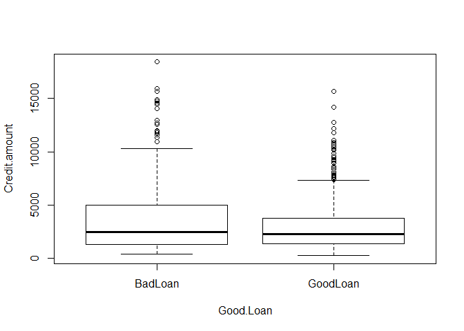

Test activity: Loan default EDA - solution
================
ECON 122

## First steps

Make sure you completed the steps in this test assignment’s GitHub
README file. Keep the output type for this .Rmd a `github_document`.

## To Do: Complete before Friday’s class (9/5/19)

Use full sentences to answer the questions below. Provide your answer
and, if needed, an R chunk used to answer the question. You should be
able to complete questions 1-4 with a little review of intro stats R
commands. Give questions 5 and 6 a try even if you can’t fully answer
them.

## Data description:

The data for today’s review example is a “classic” German credit data
set. Each entry in the data set represents a loan given by the bank,
along personal characteristics of the person the loan was given to, the
type of loan and whether or not they paid it off or defaulted. At the
time, the deutsch mark was the unit of currency so an “DM” in the
dataset refers to that unit of measurement. One of the main questions
about this dataset is to understand factors associated with a loan
defaulting (or not). For this analysis the variable `Good.Loan`
indicates whether a loan was paid off (`GoodLoan`) or whether it
defaulted
(`BadLoan`).

``` r
> loans <- read.csv("http://raw.githubusercontent.com/mgelman/data/master/day1CreditData.csv")
> str(loans)
'data.frame':   700 obs. of  21 variables:
 $ Status.of.existing.checking.account                     : Factor w/ 4 levels "... < 0 DM","... >= 200 DM / salary assignments for at least 1 year",..: 1 1 4 4 1 3 1 3 4 1 ...
 $ Duration.in.month                                       : int  24 36 48 36 48 48 24 30 36 24 ...
 $ Credit.history                                          : Factor w/ 5 levels "all credits at this bank paid back duly",..: 4 2 2 4 5 3 4 4 4 4 ...
 $ Purpose                                                 : Factor w/ 10 levels "business","car (new)",..: 3 6 8 8 3 5 6 8 2 2 ...
 $ Credit.amount                                           : int  6579 2348 3578 2394 4605 6224 4169 1715 909 4817 ...
 $ Savings.account.bonds                                   : Factor w/ 5 levels ".. >= 1000 DM",..: 2 2 5 5 2 2 2 5 4 2 ...
 $ Present.employment.since                                : Factor w/ 5 levels ".. >= 7 years",..: 5 3 1 3 1 1 3 3 1 4 ...
 $ Installment.rate.in.percentage.of.disposable.income     : int  4 3 4 4 3 4 4 4 4 2 ...
 $ Personal.status.and.sex                                 : Factor w/ 4 levels "female : divorced/separated/married",..: 4 3 4 1 4 4 4 1 4 4 ...
 $ Other.debtors.guarantors                                : Factor w/ 3 levels "co-applicant",..: 3 3 3 3 3 3 3 3 3 1 ...
 $ Present.residence.since                                 : int  2 2 1 4 4 4 4 1 4 3 ...
 $ Property                                                : Factor w/ 4 levels "if not A121 : building society savings agreement/life insurance",..: 4 1 3 2 4 4 1 2 1 1 ...
 $ Age.in.years                                            : int  29 46 47 25 24 50 28 26 36 31 ...
 $ Other.installment.plans                                 : Factor w/ 3 levels "bank","none",..: 2 2 2 2 2 2 2 2 2 2 ...
 $ Housing                                                 : Factor w/ 3 levels "for free","own",..: 1 2 2 2 1 1 2 2 2 2 ...
 $ Number.of.existing.credits.at.this.bank                 : int  1 2 1 1 2 1 1 1 1 1 ...
 $ Job                                                     : Factor w/ 4 levels "management/ self-employed/highly qualified employee/ officer",..: 1 2 2 2 2 2 2 2 2 2 ...
 $ Number.of.people.being.liable.to.provide.maintenance.for: int  1 1 1 1 2 1 1 1 1 1 ...
 $ Telephone                                               : Factor w/ 2 levels "none","yes, registered under the customers name": 2 2 2 1 1 1 1 1 1 2 ...
 $ foreign.worker                                          : Factor w/ 2 levels "no","yes": 2 2 2 2 2 2 2 2 2 2 ...
 $ Good.Loan                                               : Factor w/ 2 levels "BadLoan","GoodLoan": 2 2 2 2 1 1 2 2 2 1 ...
```

## 1\. Data basics

How many loan cases are in the data? How many variables?

*answer:* There are 700 cases in the data set and 21 variables.

``` r
> # R chunk for questions above (if needed)
> dim(loans)
[1] 700  21
```

We will not use all the variables in this handout. Here is a brief
description of the variables used in this handout:

| Variable          | description                 |
| ----------------- | --------------------------- |
| Duration.in.month | loan length in months       |
| Credit.amount     | amount of loan (in DM)      |
| Good.Loan         | did the loan default or not |

## 2\. Default rate

What percentage of loans in this dataset defaulted?

``` r
> table(loans$Good.Loan)

 BadLoan GoodLoan 
     218      482 
> props <- prop.table(table(loans$Good.Loan))
> props

  BadLoan  GoodLoan 
0.3114286 0.6885714 
```

*answer:* About 31.1% of these loans defaulted.

## 3\. Default rate by duration

What is the average loan duration in this data? Of the loans that
defaulted, What percent have a duration of 2 years or less? More than 2
years?

``` r
> summary(loans$Duration.in.month)
   Min. 1st Qu.  Median    Mean 3rd Qu.    Max. 
   4.00   12.00   18.00   20.79   24.00   60.00 
> default <- loans$Good.Loan == "BadLoan"
> mean(default)
[1] 0.3114286
> # of defaults, what % <= 24?
> perc.24less<- mean(loans$Duration.in.month[default] <=24)
> perc.24less
[1] 0.6880734
> 1-perc.24less
[1] 0.3119266
```

*answer:* The average loan duration is 20.8 months. Of the loans that
defaulted, 68.8% have a duration of 2 years or less. 31.2% have a
duration of more than two years

## 4\. Default rate and credit amount

What is the median credit amount for loans that defaulted? for loans
that didn’t default? Create a graph that that shows the credit amount
distribution for each type of loan (good vs. bad), then compare these
distributions.

``` r
> summary(loans$Credit.amount)
   Min. 1st Qu.  Median    Mean 3rd Qu.    Max. 
    250    1350    2308    3331    3998   18424 
> meds <- tapply(loans$Credit.amount, loans$Good.Loan, median)
> meds
 BadLoan GoodLoan 
  2450.5   2249.0 
```

*answer:* The median credit amount for loans that defaulted was 2450.5
DM, while the median amount for good loans was 2249
DM.

``` r
> boxplot(Credit.amount ~ Good.Loan, data=loans)
```

<!-- -->

## 5\. A default prediction model

Suppose that Barb the data scientist generates the following model
criteria to predict when a loan will default. A loan will default if
either criteria below is met:

  - Duration is longer than 2 years and credit amount is greater than
    10,000 DM.
  - Duration is 2 years or less and credit amount is less than 2200 DM.

Use this model to predict defaults for the loan data. (Hint: You will
likely need to use the “and” operator `&`.) Then use the actual and
predicted default variables to find the following rates:

  - What is the model’s *accuracy* rate, i.e. the percentage of all
    loans that are correctly classified as good or bad?
  - What is the model’s *false positive rate*, i.e. the percentage of
    good loans that are predicted to default (a “positive” result)?
    (This is 1 minus the *specificity* of the model)
  - What is the model’s *false negative rate*, i.e. the percentage of
    bad loans that are predicted to not default (a “negative” result)?
    (This is 1 minus the *sensitivity* of the
model)

<!-- end list -->

``` r
> pred.Default1 <- ifelse(loans$Duration.in.month > 24 & loans$Credit.amount > 10000,"predBad","predGood")
> table(pred.Default1)
pred.Default1
 predBad predGood 
      26      674 
> pred.Default <- ifelse(loans$Duration.in.month <= 24 & loans$Credit.amount < 2200,"predBad",pred.Default1)
> table(pred.Default1,pred.Default)
             pred.Default
pred.Default1 predBad predGood
     predBad       26        0
     predGood     325      349
> table(loans$Good.Loan,pred.Default)
          pred.Default
           predBad predGood
  BadLoan      103      115
  GoodLoan     248      234
> props.all<- prop.table(table(loans$Good.Loan,pred.Default))
> props.all
          pred.Default
             predBad  predGood
  BadLoan  0.1471429 0.1642857
  GoodLoan 0.3542857 0.3342857
> props.byrow<- prop.table(table(loans$Good.Loan,pred.Default),1)
> props.byrow
          pred.Default
             predBad  predGood
  BadLoan  0.4724771 0.5275229
  GoodLoan 0.5145228 0.4854772
```

*answer:* For this data, the accuracy rate for this model is 48.1%. The
false positive rate is 51.5% and the false negative rate is 52.8%.

## 6\. Try your default prediction model

Try changing one or two parts of Barb’s simple default criteria and see
if you can get a better rates than Barb (higher accuracy and/or lower
false rates).
