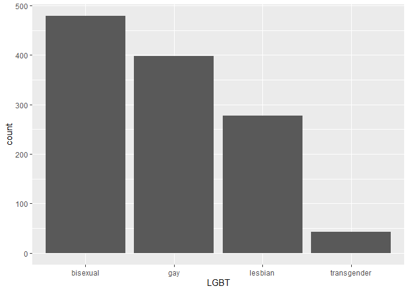

Intro to `ggplot2`
================
ECON 122
Day 4

Trump Tweets
------------

Let's revisit the data collected on Trump tweets.

``` r
> tweets<- read.csv("http://raw.githubusercontent.com/mgelman/data/master/TrumpTweetData.csv")
> tweets[226,"charCount"]=76
```

We will focus on the following variables:

<table style="width:69%;">
<colgroup>
<col width="13%" />
<col width="55%" />
</colgroup>
<thead>
<tr class="header">
<th>Variable</th>
<th>Description</th>
</tr>
</thead>
<tbody>
<tr class="odd">
<td><code>source</code></td>
<td>type of device used to sent the tweet</td>
</tr>
<tr class="even">
<td><code>charCount</code></td>
<td>how many characters used in the tweet (excluding spaces and weblinks)</td>
</tr>
<tr class="odd">
<td><code>nWords</code></td>
<td>number of &quot;words&quot;&quot; in the tweet (excluding weblinks and retweets)</td>
</tr>
<tr class="even">
<td><code>nRealWords</code></td>
<td><code>nwords</code> minus the number of numbers or &quot;stopwords&quot; (like &quot;a&quot;, &quot;the&quot;, etc) in the tweet</td>
</tr>
</tbody>
</table>

First look at basic summaries of the variables

``` r
> summary(tweets[,c("source","charCount","nWords","nRealWords")])
        source      charCount          nWords       nRealWords    
 Android   :762   Min.   :  0.00   Min.   : 0.0   Min.   : 0.000  
 iPhone    :628   1st Qu.: 63.00   1st Qu.: 6.0   1st Qu.: 3.000  
 Web Client:120   Median : 97.00   Median :16.0   Median : 7.000  
 NA's      :  2   Mean   : 86.96   Mean   :14.6   Mean   : 6.364  
                  3rd Qu.:114.00   3rd Qu.:23.0   3rd Qu.:10.000  
                  Max.   :128.00   Max.   :32.0   Max.   :19.000  
```

Graphs for quantitative variable
--------------------------------

The basic graphs for quantitative (numeric) variables are geoms for `histogram`, `density`, `boxplot`, and `points` plot. Let's first just explore the distribution of character count.

The distribution of character count is

``` r
> library(ggplot2)
> w <- ggplot(data=tweets, aes(x=charCount))
> w + geom_histogram() + ggtitle("Character Count Distribution") + xlab("Number of characters per tweet")
```


You can change the `binwidth` size to modify bar width:

``` r
> w + geom_histogram(binwidth = 1) + ggtitle("Character Count Distribution")
```


### Question 1: Create a histogram of `nWords`. Note the many tweets with word counts of 0. Word counts of 0 mean the tweet was a retweet or link. Create a histogram of word counts that omits 0 word tweets.

How does character count relate to tweet source? We could compare distributions with a side-by-side boxplot:

``` r
> w <- ggplot(data=tweets, aes(x=source,y=charCount))
> w + geom_boxplot() + ggtitle("Character count by source")
```


You can create a horizontal version by calling the `last_plot()` created and flipping axes with `coord_flip()`:

``` r
> last_plot() + coord_flip()
```


You can also compare distributions more thoroughly using density curves for each group. The variable `source` will be used to set the aesthetic `color`:

``` r
> w <- ggplot(data=tweets, aes(x=charCount))
> w + geom_density(aes(color=source)) + ggtitle("Character count by source")
```


#### Question 2: Why there is a spike in the density? Can you really compare source distributions with this density included?

Recreate the density plot but excluding missing data sources:

``` r
> w <- ggplot(data=tweets[!is.na(tweets$source),], aes(x=charCount))
> w + geom_density(aes(color=source)) + ggtitle("Character count by source")
```


#### Question 3: Any idea why different tweet device sources have different character count distributions?

#### Question 4: Add a density curve to the `charCount` histogram created above.

How do `nWords` and `nRealWords` relate? We could explore this with a scatterplot because both variables are quantitative. We will show how to add both a least squares line and a trend smoother line.

``` r
> w <- ggplot(data=tweets, aes(x=nWords, y=nRealWords)) + geom_point()
> w + geom_smooth()  # adds smoother (loess or gam)
```


``` r
> last_plot() + geom_smooth(method="lm", color="red") 
```


#### Question 5: Does the relationship look linear? linear over a restricted range of `nWords`? What does adding `scale_x_sqrt()` and `scale_y_sqrt()` to the previous plot do to the plot? Does it make the relationship follow a linear trend better than the original scale?

#### Question 6: There are over 1000 tweets in the data. Why don't we see over 1000 glyphs in the plot. In the previous code chunk, what happens when you replace `geom_points()` with `geom_jitter()`?

#### Question 7: Are there tweets that are all "real words"? Add `geom_abline(intercept=0,slope=1)` to the original (unjittered) scatterplot to see.

Does this relationship depend on tweet source? We could explore this visually a couple ways: using a color cue assigned to each glyph or by faceting.

Here is a plot colored by `source` after omitting the 2 NA sources from the data frame. (The NA `source` group will cause the smoother to fail because there are not enough cases to produce a good smoother trend line.)

``` r
> w <- ggplot(data=tweets[!is.na(tweets$source),], aes(x=nWords, y=nRealWords, color=source)) + geom_jitter()
> w + geom_smooth(se=FALSE) + geom_smooth(method="lm", se=FALSE)
```


#### Question 8: What does `se=FALSE` do (you can try removing it to compare plots)? Why did we have to remove the `color` argument from `geom_smooth`?

#### Question 9: Add `size=.4` to the `jitter` geom and `linetype=2` to the `lm` smoother. What changes?

Now we will try faceting by `source`:

``` r
> w <- ggplot(data=tweets[!is.na(tweets$source),], aes(x=nWords, y=nRealWords)) + geom_jitter()
> w + geom_smooth(se=FALSE) + geom_smooth(method="lm", se=FALSE, color="red") + facet_wrap(~source)
```


#### Question 10: Try rerunning the facet chunk without omitting the NA sources. What happens?

#### Question 11: Which visual method gives a clearer comparison of the word trends in the three sources?

Graphs for categorical variables
--------------------------------

Survey data is a good source for variables with categorical responses. We will switch to data collected from the 2013 Pew Survey of LGBT Americans. Non-responses are denoted as blank spaces in the dataset and we need to inform R of this when reading in this `.csv` (otherwise blank responses will be treated as an actual response level when R reads in this type of (mainly) factor data):

``` r
> pew<- read.csv("http://raw.githubusercontent.com/mgelman/data/master/PewLGBT2013.csv", na.strings = c(NA," ","Refused"))
```

A bar graph of `LGBT` variable summarizes the distribution of respondents LGBT identity:

``` r
> a <- ggplot(pew, aes(x=LGBT) )
> a + geom_bar() 
```



#### Question 12: What happens if you change coordinate systems and add `coord_polar()` to the last plot? (This is called a Coxcomb graph.)

You can rotate labels by rotating text on the x-axis.

``` r
> a + geom_bar() + theme(axis.text.x=element_text(angle=60,hjust=1))
```


#### Question 13: What happens when you change the `hjust` number to something bigger? something negative?

Let's explore how LGBT identify relates to another categorical variable response, `Q2`, that measures whether an individual thinks the nation is on the "right direction" or "wrong track". Here we use `Q2` answers to `fill` the bars and create a stacked bar graph:

``` r
> a + geom_bar(aes(fill=Q2)) + scale_fill_discrete(name="Nation headed in")
```


Note that the scale type is `fill`, so we used `scale_fill_discrete` to change the legend name.

Let's make another change by adding `position=fill` to the `bar` geom:

``` r
> a + geom_bar(aes(fill=Q2), position="fill") + scale_fill_discrete(name="Nation headed in")
```


#### Question 14: What is the scale of the y-axis? Once you figure this out, change the label from `count` to something more appropriate. Is there an association between LGBT identity and the respond to the right track/wrong track question?

#### Question 15: What do the gray sections represent? The gray sections are present in the count version of this graph, but why are they hard to see?

#### Question 16: Facet the previous graph by `PARTY`, the political affiliation of the respondent. Does the relationship between LGBT and right track/wrong track seem to depend upon `PARTY`?
